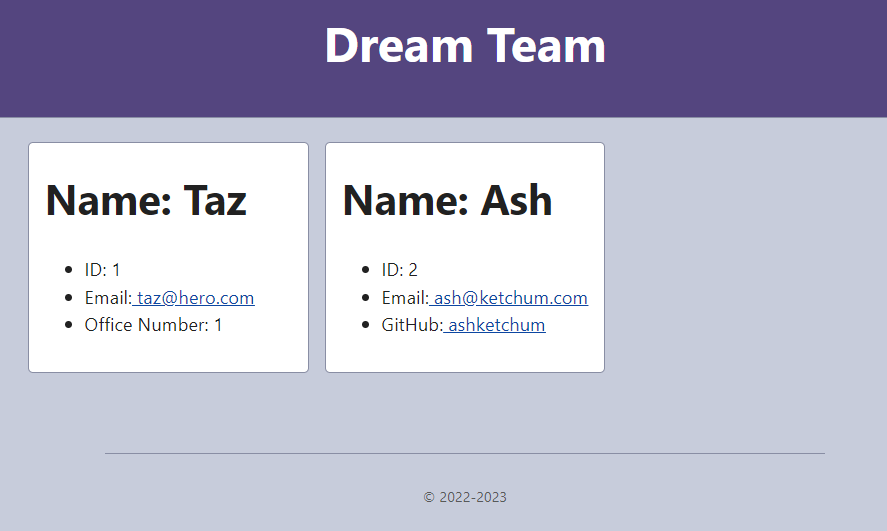

# dream-team-generator
[Link to my project](https://github.com/Deiontre10/dream-team-generator)

## Table of Contents
- [Description](#description)
- [Visuals](#visuals)

## Description
Dream Team Generator is a tool that helps to create and organize teams. You first add your manager and then as many engineers and interns as you would like. After you have added all members you then select finish to generate your page with your teams info.

## Visuals

